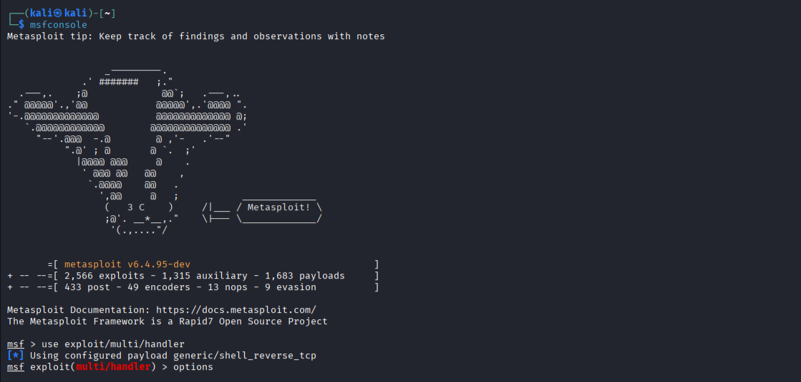

# Detection-Lab
A simulated Reverse TCP Shell attack and SOC Analyst response. 

In the first half of the simulation, I created a reverse TCP shell virus.  Next, I enacted a social engineering phishing attack where an end user downloaded the infected file.  In the second part, a SOC Analyst performs digital forensic analysis on the network, quarantines the virus, and escalates the ticket to a SOC Manager, using best practices from the organization's playbooks. 

## Objective

The Detection Lab project aimed to establish a controlled environment for simulating and detecting cyber attacks. The primary focus was to ingest and analyze logs within a Security Information and Event Management (SIEM) system, generating test telemetry to mimic real-world attack scenarios. This hands-on experience was designed to deepen understanding of network security, attack patterns, and defensive strategies.

### Skills Learned

- Advanced understanding of SIEM concepts and practical application.
- Proficiency in analyzing and interpreting network logs.
- Ability to generate and recognize attack signatures and patterns.
- Enhanced knowledge of network protocols and security vulnerabilities.
- Development of critical thinking and problem-solving skills in cybersecurity.

### Tools Used

- Virtual machines running Windows 10 (Enduser) and Kali (attacker and SOC analyst) -- VirtualBox
- Command Line Interface for Red Team, virus creation, attack, and Blue Team, defense response -- Powershell, Bash, Python
- Network detection and virus payload deployment -- Nmap and Metasploit
- Security Information and Event Management (SIEM) system for log ingestion and analysis -- Sysmon and Splunk 
- Network analysis tools for capturing and examining network traffic. -- Wireshark
- Telemetry generation tools to create realistic network traffic and attack scenarios. -- Sysmon and Splunk

## Steps

Part 1 - Red Team Attack
1. Create an Internal Network using VirtualBox and configure Sysmon, Splunk, Wireshark
2. Create a Metasploit TCP reverse shell virus file named Resume.PDF.exe
   
   
   
4. Initiate social engineering phishing attack with an email to HR Rep
5. Use msfConsole to initiate reverse shell and take command of target device
6. Move laterally through the device to obtain private files

Part 2 - Blueteam Response 
1. Isolate end user device
2. Analyze Wireshark packet capture and Splunk logs
3. Remove infected files
4. Identify affected personal files
5. Identify changes made
6. Restore from backup
7. Create a report for escalation and suggestions for further mitigation
